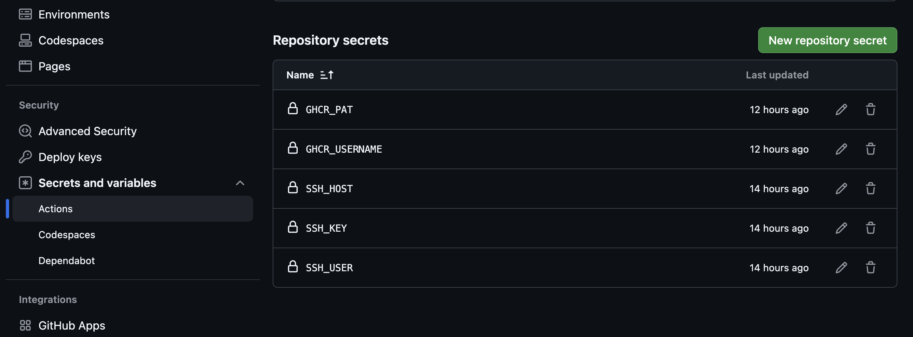

# Conduit Fullstack Container Project with CI/CD Pipeline (GitHub Actions)

A complete Conduit demo application featuring an Angular frontend and a Django backend, packaged with Docker and Docker Compose for simple, reproducible setup and deployment.

## Table of Contents

1. [Prerequisites](#prerequisites)
2. [Quickstart](#-quickstart)
3. [Usage](#-usage)
   - [CI/CD Pipeline (GitHub Actions)](#-ci/cd-pipeline-github-actions)
   - [Create a Docker Container](#-create-a-docker-container)
   - [Docker Management Commands](#docker-compose-commands)
4. [Project Checklist](#project-checklist)

## Prerequisites

Before you begin, ensure that the following are installed and set up on your local machine or server:
- [Docker](https://docs.docker.com/get-docker/)

Info: Docker Compose is automatically included in Docker Desktop and Docker Engine.

## 🚀 Quickstart

Clone this repository and follow the setup instructions below to get the application running.

Open your command line and type the following commands:
With SSH configured (if SSH Keys are provided to GitHub)
```
git clone git@github.com:MWorksCoding/conduit-container.git
```
Classic HTTPS (if no SSH Keys are provided to GitHub)
```
git clone https://github.com/MWorksCoding/conduit-container.git
```

Navigate to the root project directory you just cloned.
```
cd conduit-container
```

> [!NOTE]
> Inside your root directory, you need to create a `.env` file for your environment variables.  
> You can copy and paste the content from [example.env](./example.env) by running:
>
> ```
> cp example.env .env
> ```
>
> Please keep in mind that the values should only be used for local development for security reasons.


Now switch to conduit-backend-master directory.
```
cd conduit-backend-master
```
> [!NOTE]
> Inside your conduit-backend-master directory, you need to create a `.env` file for your environment variables.  
> You can copy and paste the content from [backend example.env](./conduit-backend-master/example.env) by running:
>
> ```
> cp example.env .env
> ```
>
> Please keep in mind that the values should only be used for local development for security reasons.

Docker Compose automatically loads .env files, so you don’t need to reference it manually.

Go back to parent directory.
```
cd ..
```

From here start the server with Docker Compose. The both Dockerfiles from backend und frontend directories are called.
```
docker compose up -d --build
```

You can check our your localhost at port 8080:
```
http://localhost:8282
```

Or if running on a server with a public IP:
```
http://<your-ip>:8282
```

Here you can see the Conduit Website. Feel free to sign up und create your own feed.

A superuser is an administrator account that has full access to Django’s built-in admin panel.
As a superuser you can manage all data in the backend: create, edit, or delete users, moderate articles, comments, profiles and inspect or fix data manually.

For creating a superuse we need to find out the running Docker Backend Container ID

```
docker compose ps
```

Then you paste this container id here to access the docker container and create a superuser
```
docker exec -it <container_id_or_name> python manage.py createsuperuser
```

You need to enter a username, a email address and a password.
Once completed, the admin account is created.
After that log in to the Django admin by opening http://<your-server-ip>:8000/admin
Log in with the credentials you just created.

Please check the list of typical Docker commands in the section [Docker Management Commands](#docker-compose-commands)

## 🧑‍💻 Usage

### 🚀 CI/CD Pipeline (GitHub Actions)

This project includes a fully automated CI/CD pipeline using GitHub Actions, GitHub Container Registry (GHCR), and Docker Compose on your VPS.

The pipeline:

- Builds the backend & frontend Docker images
- Pushes them to GHCR
- SSHs into your server
- Pulls the latest images
- Restarts your docker-compose stack
- Runs on every branch automatically

Can also be triggered manually via “Run workflow”

> [!NOTE]
> 📦 Required GitHub Secrets
> To use the CI/CD pipeline in your own repository, you must configure these secrets under:
> GitHub → Repository → Settings → Secrets and variables → Actions
> 

🔐 Server Access

These are required for GitHub Actions to SSH into your VPS:

- SSH_HOST → Your server IP
- SSH_USER → The Linux user that owns the VPS deployment directory
- SSH_KEY → The private SSH key that matches the public key stored in ~/.ssh/authorized_keys on your server
- GHCR_PAT → Your Personal Access Token (PAT)
- GHCR_USERNAME → Your GitHub username

You can check the [example.secrets.env](./example.secrets.env) to see how the secrets can look like. But keep in mind you need to set the variables one by one in GitHub → Repository → Settings → Secrets and variables → Actions

> [!NOTE]
> Generate your Container Registry Access PAT via:
> GitHub → Settings → Developer Settings → Personal access tokens → Personal access tokens (classic)
> Minimum required permissions:
> Packages: Read & Write
> Metadata: Read
> Select the repo → Contents: Read
>
> You can test GHCR authentication locally:
>```
>echo "<YOUR_GHCR_PAT>" | docker login ghcr.io -u <YOUR_USERNAME> --password-stdin
>```

🛠️ How Deployment Works

When you push to any branch, or run the workflow manually:

1. GitHub Actions checks out your repository
2. Builds backend & frontend Docker images
3. Logs in to GHCR
4. Pushes images to:
   - ghcr.io/YOUR_USERNAME/YOUR_REPO-backend:latest
   - ghcr.io/YOUR_USERNAME/YOUR_REPO-frontend:latest
5. Connects to your VPS via SSH
6. Pulls the latest image versions
7. Restarts your Docker Compose stack:
   - docker compose down
   - docker compose up -d --pull always
8. Your application is redeployed instantly 🎉


### 🐳 Create a Docker Container

General Informations:

To containerize a project, we need to create a file named `Dockerfile`. In our case we man to containerize a frontend app and a backend app. So both directory needs to have a individual `Dockerfile`. You check the [frontend Dockerfile](./conduit-frontend-master/Dockerfile) here and the [backend Dockerfile](./conduit-backend-master/Dockerfile) here. 
To reduce image size and improve build performance, we need to create a `.dockerignore` file for both directories. You check the [frontend .dockerignore](./conduit-frontend-master/.dockerignore) here and the [backend .dockerignore](./conduit-backend-master/.dockerignore) here. 

That [docker-compose.yml](./docker-compose.yaml) file tells Docker exactly how to build, run, configure, and manage your project — all in one place.

In our case all required files already exist. There is nothing to do here.

### Docker Compose Commands

| Command | Description |
|--------|-------------|
| `docker compose build` | Build the Docker image according to your Dockerfile. |
| `docker compose build --no-cache` | Build from scratch without using cached layers. |
| `docker compose up` | Start the container in the foreground (logs visible). |
| `docker compose up -d` | Start the container in detached/background mode. |
| `docker compose up --build` | Build and start containers at the same time. |
| `docker compose up --build -d` | Build and start containers in detached mode. |
| `docker compose stop` | Stop running containers without removing them. |
| `docker compose restart` | Restart all running services. |
| `docker compose down` | Stop and remove containers, networks, and volumes. |
| `docker compose logs -f` | Follow logs in real time. |
| `docker compose logs` | Show logs without following. |
| `docker compose ps` | List running containers. |

## Project Checklist

You can find a detailed checklist for this project in PDF format:

- [Download the Checklist](../conduit-container-cicd/docs/checklist.pdf)